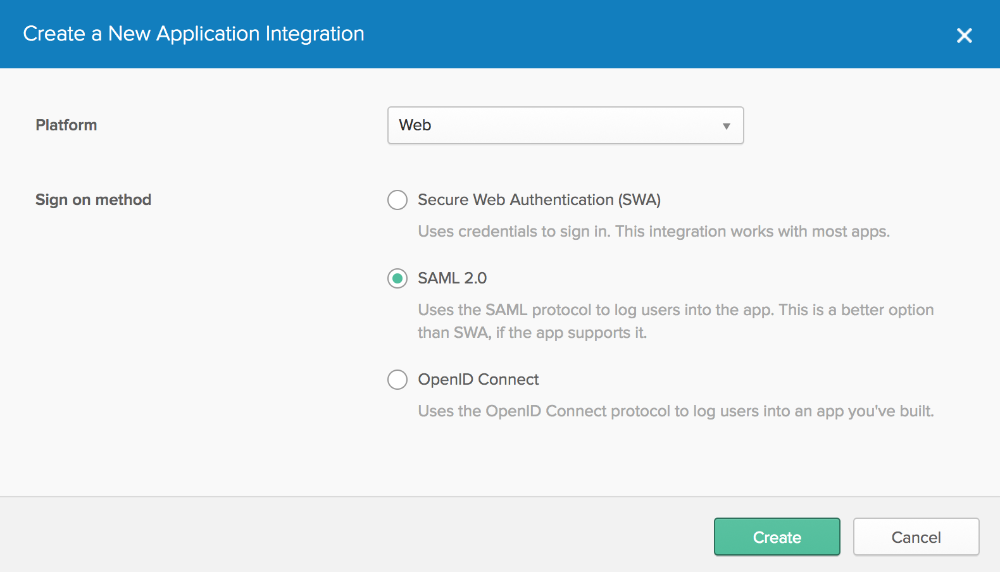
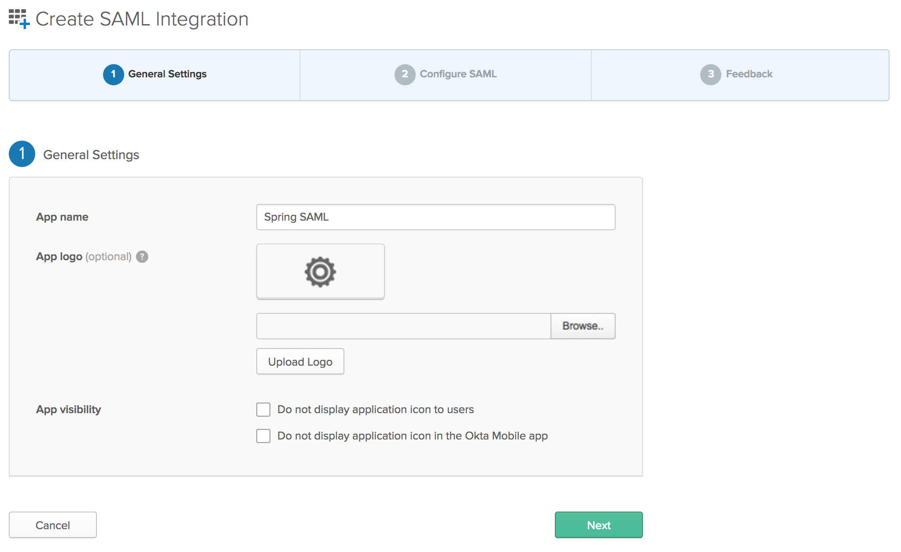
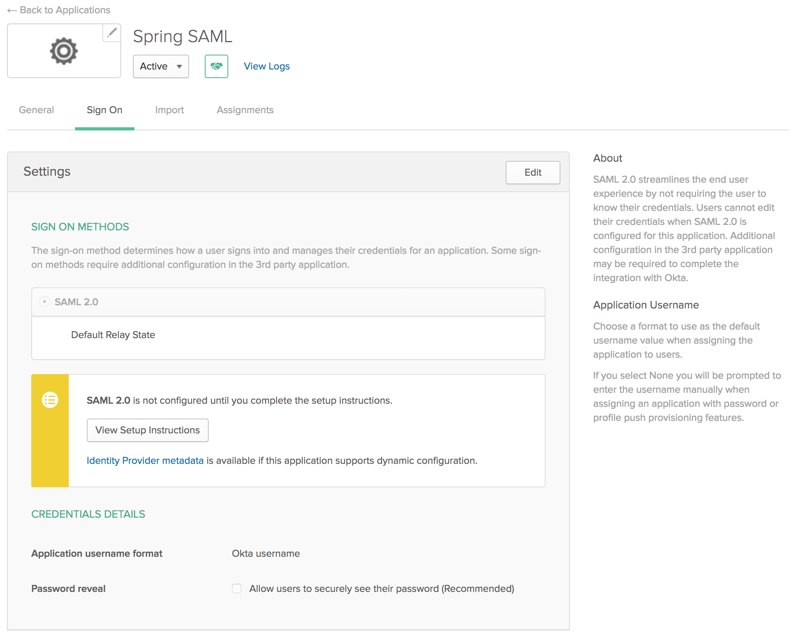

## Spring Security SAML Sample with Spring Boot ##
This sample uses the plain old spring-security-saml library to add SP capabilities to a Spring Boot app, allowing it to authenticate against different IdPs.
The main purpose of this module is to expose the extensive configuration required to use Spring Security SAML, in comparison with the `spring-boot-security-saml` plugin for Spring Boot, that deals with all this complexities internally.

### Availabe IdPs ####

- [SSO Circle](http://www.ssocircle.com/en/)
- [OneLogin](https://www.onelogin.com/)
- [Ping One Clound] (https://www.pingidentity.com/en/products/pingone.html)
- [OKTA](https://www.okta.com)

### Credentials ###

Use the following credentials:

- *SSO Circle:* Register with [SSO Circle] (http://www.ssocircle.com/en/) and use those credentials to login in the application.
- *OneLogin:* The user must be created in your OneLogin account. See below.  
- *Ping One:* user: dough1234321@gmail.com pass: Test1234!
- *OKTA:* The user must be created in your OKTA account. See below.

### OneLogin configuration ###

To use OneLogin with this sample application, you'll have to:
- Create an [OneLogin developers account](https://www.onelogin.com/developer-signup)
- Add a SAML Test Connector (IdP)
- Configure the OneLogin application with:
  - *RelayState:* You can use anything here.
  - *Audience:* localhost-demo
  - *Recipient:* http://localhost:8080/saml/SSO
  - *ACS (Consumer) URL Validator:* ^http://localhost:8080/saml/SSO.*$
  - *ACS (Consumer) URL:* http://localhost:8080/saml/SSO
  - *Single Logout URL:* http://localhost:8080/saml/SingleLogout
  - *Parameters:* You can add additional parameters like firstName, lastName.
- In the SSO tab:
  - *X.509 Certificate:* Copy-paste the existing X.509 PEM cerficate into idp-onelogin.xml (ds:X509Certificate).
  - *SAML Signature algorythm:* Use the SHA-256, although SHA-1 will still work.
  - *Issuer URL:* Replace the entityID in the idp-onelogin.xml with this value.
  - *SAML 2.0 Endpoint (HTTP):* Replace the location for the HTTP-Redirect and HTTP-POST binding in the idp-onelogin.xml with this value.
  - *SLO Endpoint (HTTP):* Replace the location for the HTTP-Redirect binding in the idp-onelogin.xml with this value.

### OKTA configuration ###
To use OKTA with this sample application, you'll have to:

#Create a SAML App in Okta#

The first thing you'll need to do is create an Okta account at [okta.com/integrate/signup](https://www.okta.com/integrate/signup/). After activating your account, log in to it. If you just created an account, you'll see a screen similar to the one below.

 
Click on **< > Developer Console** in the top-left corner and switch to the Classic UI. If you see a screen like the following, you're good to go! The reason you need to use the Classic UI for this tutorial is because we haven't yet added SAML support to the [Developer Console](/blog/2017/09/25/all-new-developer-console).

Click **Add Applications** in the top right to continue. This will bring you to a screen with a **Create New App** green button on the left.

Click the button and choose **Web** for the platform and **SAML 2.0** for the sign on method.

Click the **Create** button. The next screen will prompt you for an application name. I used "Spring SAML”, but any name will work.

Click the **Next** button. This brings you to the second step, configuring SAML. Enter the following values:

Generate keystore using command:-
**keytool -genkeypair -alias devanjali -keypass devanjali -storepass devanjali -keystore saml-demo.jks -keysize 1024**

Export certificate from keystore:-
**keytool -export -alias devanjali -file saml-demo.cer -keystore saml-demo.jks**

use saml-demo.cer in OKTA configurations as **Singnature certificate**

Scroll to the bottom of the form and click **Next**. This will bring you to the third step, feedback. Choose "I'm an Okta customer adding an internal app” and optionally select the App type.

Click the **Finish** button to continue. This will bring you to the application's "Sign On” tab which has a section with a link to your applications metadata in a yellow box. Copy the **Identity Provider metadata** link as you'll need it to configure your Spring Boot application.

The final setup step you'll need is to assign people to the application. Click on the **Assignments** tab and the **Assign** > **Assign to People** button. You'll see a list of people with your account in it.

Click the **Assign** button, accept the default username (your email), and click the **Done** button.
